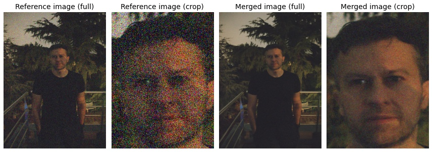
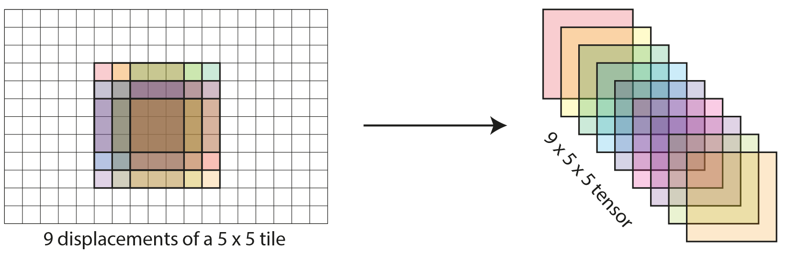

# HDR+ PyTorch

This is a simplified PyTorch implementation of HDR+, the backbone of computational photography in Google Pixel phones, described in [Burst photography for high dynamic range and low-light imaging on mobile cameras](http://static.googleusercontent.com/media/www.hdrplusdata.org/en//hdrplus.pdf).

Using an 11GB GPU, alignment works for up to 3MP grayscale images (same as the official implementation), at ~100 ms / image. 
 
# Example
 


# Usage

Here's a minimal example to align and merge a burst. For more, see [demo.ipynb](demo.ipynb).

```python
import torch
import align

# load image burst
reference_image = torch.zeros([3, 1000, 1000], dtype=torch.float16, device='cuda')
comparison_images = torch.zeros([10, 3, 1000, 1000], dtype=torch.float16, device='cuda')

# align
aligned_images = align.align_images(reference_image, comparison_images)

# merge
merged_image = (reference_image + aligned_images.sum(0)) / (1 + len(aligned_images))
merged_image = torch.clip(merged_image, 0, 1)
```

# Implementation details

The core of my implementation is stacking all tile displacements along the batch dimension and performing comparisons with the help of broadcasting. I've illustrated this for the simplest case of 9 displacements of a 5x5 tile. In reality, the number of tiles and displacements is large. I've annotated the shape of most tensors in my code, so that it's easy to see what's going on in every line.



# Missing features
- robust merge
- RAW support
- color post-processing
- automatic selection of the reference image
- CPU support (requires float32 instead of float16 for some ops)
- tile comparison in Fourier space
