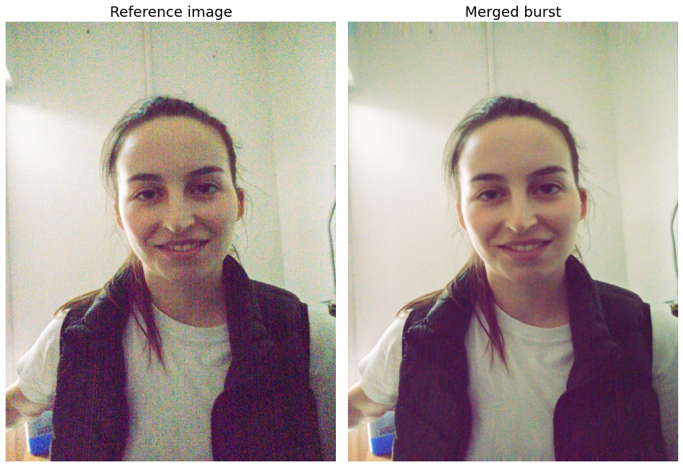

# HDR+ PyTorch

This a simplified PyTorch implementation of HDR+, the backbone of computational photography in Google Pixel phones, described in [Burst photography for high dynamic range and low-light imaging on mobile cameras](http://static.googleusercontent.com/media/www.hdrplusdata.org/en//hdrplus.pdf).

Using an 11GB GPU, alignment works for up to 3MP grayscale images (same as the official implementation), at ~150 ms / image. 
Currently, only JPEG images are supported with a simple non-robust merge and no post-processing. Tile comparisons are performed in pixel space, without any FFTs.

Supports CPU, CUDA, and TorchScript.
 

